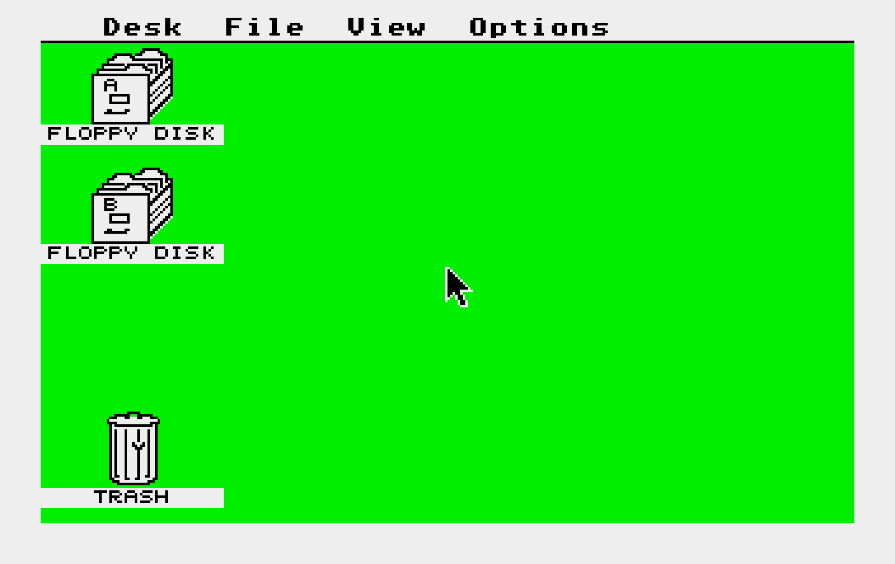
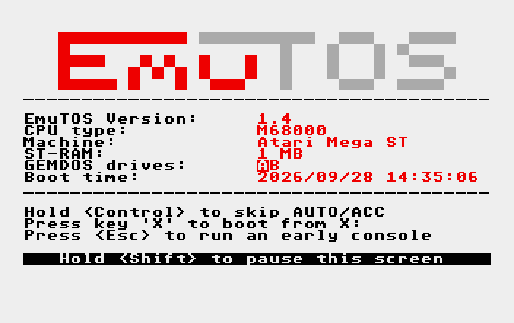

Atari ST/STe for MEGA65 (MegaST)
================================

This is a port of the [AtariST_MiSTer](https://github.com/MiSTer-devel/AtariST_MiSTer)
core (the "MiSTery" Atari ST/STe core by Till Harbaum, Gyorgy Szombathelyi, Jorge Cwik,
Alexey Melnikov and others) to the [MEGA65](https://mega65.org), using the
[MiSTer2MEGA65](https://github.com/sy2002/MiSTer2MEGA65) framework.
MEGA65 port by Chris Freeman ([@freemchr](https://github.com/freemchr)).

**Status: beta, running on real hardware.** MegaST is developed and tested on a MEGA65 R6 and
runs games and GEM programs from floppy and hard disk images. Download the core from
[Releases](https://github.com/freemchr/MegaST/releases); see below for what has been tested
on the MEGA65. Please report problems and successes in the
[issues](https://github.com/freemchr/MegaST/issues).

**Latest version: [0.4.11 beta](https://github.com/freemchr/MegaST/releases/tag/v0.4.11)**
(October 8, 2026, pre-release for testing): fixes a second hard disk write bug. **All versions up
to 0.4.10 damage hard disk images when writing** (issue #11): update, and restore your images
from a backup. Core files for the R3/R3A, R4, R5 and R6. Coming from 0.4.7 or older: copy the new
`atarist/stcfg` (99 bytes) from the zip, otherwise the menu settings are not saved.
All changes: [VERSIONS.md](VERSIONS.md).

**Support:** MegaST is free and open source. If you enjoy it, you can support its development via
[GitHub Sponsors](https://github.com/sponsors/freemchr).

Tested on a MEGA65 R6
---------------------

| Area | Result |
|------|--------|
| TOS 1.04, boot to the desktop | works |
| TOS 2.06 (STe) and EmuTOS 1.4, boot and hard disk | work (tester reports) |
| TOS 1.00, 1.02, 1.06, 1.62 | boot to the desktop in simulation, not tried on hardware yet |
| Floppy disks: loading, changing disks, reset with a disk inserted, saving | works |
| Hard disk: 4 GB `.vhd` image (MiSTer image), boot, reading files, launching programs | works |
| Hard disk: writing files | broken up to 0.4.10 (issue #11), fixed in 0.4.11 (tested in simulation), to be confirmed |
| MEGA65 keyboard, all keys (A fixed in 0.4.7), numeric keypad via MEGA | works |
| Atari ST mouse, Amiga mouse (optical, incl. right button), in port 1 or port 2 | works |
| Joystick, with debouncing for bouncing and worn switches (Suncom TAC-2) | works |
| Menu settings saved on the SD card (`stcfg`) | works |
| VGA scanlines, full borders | works |
| Games: Golden Axe, Great Giana Sisters, Turrican | work |
| Cartridges, PMOD serial/MIDI/printer, Cubase dongles, Viking card, 1351 mouse, mono monitor | not tested yet |
| HDMI "DVI mode (no sound)" with a DVI monitor | works (tester report, issue #4) |
| R3A board (`CORE-R3.xpr`, 512 KB) | works (tester report, issue #2) |
| R4/R5 boards (`CORE-R4.xpr`, `CORE-R5.xpr`) | not tested yet |

Screenshots
-----------

| TOS 1.04 desktop | EmuTOS 1.4 (included in the release zip) |
|---|---|
|  |  |

(Frames from the simulation of the core, i.e. the exact picture the core generates, before the
HDMI scaling.)

Features
--------

* Atari ST, STe, Mega STe (16 MHz) and "STEroids" modes
* 512 KB, 1 MB, 2 MB, 4 MB, 8 MB and 14 MB of ST RAM
* Blitter (always on in STe mode, optional in ST mode)
* All TOS versions: 192k TOS (1.00 - 1.04), 256k TOS (1.06, 1.62, 2.06) and EmuTOS;
  `tos.img` is loaded at power on, another TOS image can be loaded from the menu
* Two floppy drives (`.st` images, read/write), can be swapped (boot from B:); blank disk
  images can be created with `tools/make_st_disk.py`
* Two ACSI hard disks (`.hd`/`.img`/`.vhd` images, read/write, directly on the SD card, up to 4 GB)
* ROM cartridges (raw `.img` or `.stc`, up to 128 kB)
* Viking/SM194 compatible 1280x1024 monochrome card (shown as 640x512 grey scale)
* Serial port (RS232), MIDI and parallel (printer) port on the MEGA65's PMOD headers
* Color (low/medium resolution, 50/60 Hz) and monochrome (SM124, 71 Hz or 60 Hz) monitor,
  normal or full borders (overscan)
* YM2149 and STe DMA sound
* Real IKBD (HD6301) with the MEGA65 keyboard mapped directly into the ST keyboard matrix,
  numeric keypad via the MEGA key
* Mega ST real time clock (RP5C15), set from the MEGA65's real time clock
* Atari ST mouse (or a mouSTer in Atari mode), Amiga mouse or Commodore 1351 mouse in MEGA65
  joystick port 1 or 2 (menu "Controllers & ports"), joystick in the other port, STe enhanced
  joystick ports (fire button only)
* Cubase 2 and Cubase 3 dongle in the cartridge port
* HDMI (720p/576p/480p/600p) and VGA output: 31 kHz (optionally with scanlines) or 15 kHz RGB
  (optionally with composite sync, e.g. for SCART), zoom-in without the border

Requirements
------------

* **MEGA65 R3, R3A, R4, R5 or R6** board. On the R4-R6 the ST RAM is in the SDRAM (up to 14 MB).
  The R3/R3A has no SDRAM, and its HyperRAM is too slow for the ST's cycle exact memory timing, so
  its own core (`MegaST-R3-...cor`) keeps the ST RAM in the FPGA's block RAM: **512 KB ST RAM**,
  no Viking card and no STEroids mode, everything else is the same.
* SD card with a folder `/atarist` containing
  * `tos.img`: your TOS image (mandatory). The release zip contains the free
    [EmuTOS](https://emutos.sourceforge.io) as `tos.img`; a TOS ROM dump of your own Atari also works.
  * your floppy disk images (`.st`), hard disk images (`.hd`, `.img`, `.vhd`) and cartridges (`.stc`, `.img`)
  * optionally `stcfg`, an empty settings file, if you want the menu settings to be saved (included
    in the release zip, or `cd M2M/tools && ./make_config.sh stcfg auto`). The file must have exactly
    as many bytes as the menu has lines (`OPTM_SIZE` in `CORE/vhdl/config.vhd`, currently 99). When
    the menu changes in a new release, a settings file of the old size is ignored: use the new one.

Usage
-----

* Press <kbd>Help</kbd> to open the on-screen menu: mount floppy disks, choose the machine
  type, memory size, video output and more. "Reset Atari ST" resets the ST (like the reset
  button of the MEGA65, the ST RAM is kept).
* Keyboard mapping (the MEGA65 has a C64 style layout, symbols are mapped by position):

  | MEGA65               | Atari ST             |
  |----------------------|----------------------|
  | F1, F3, F5, F7, F9   | F1, F3, F5, F7, F9   |
  | Shift + F1 .. F9     | F2, F4, F6, F8, F10  |
  | F11, Run/Stop        | Undo                 |
  | F13                  | Help                 |
  | Inst/Del             | Backspace            |
  | Arrow up (↑)         | Delete               |
  | No Scroll            | Insert               |
  | Clr/Home             | Clr/Home             |
  | Ctrl, Alt, Esc, Tab  | Control, Alternate, Esc, Tab |
  | Caps Lock            | Caps Lock            |
  | `+` `-` `£`          | `-` `=` `\`          |
  | `@` `*` `←`          | `[` `]` `` ` ``      |
  | `:` `;` `=`          | `;` `'` ISO key (`<>`) |

* Numeric keypad: hold the <kbd>MEGA</kbd> key. MEGA + `0`..`9`, `+`, `-`, `*`, `/`, `.` and
  <kbd>Return</kbd> are the keypad keys, MEGA + Shift + `8` / `9` are the keypad keys `(` and `)`.
* **Keyboard "as printed"** (0.4.8, "Controllers & ports" → "Keyboard", issue #6): digits and symbols
  give the character printed on the MEGA65 key instead of the ST key at the same position, e.g.
  Shift + `2` is `"`, `+` is `+`, `@` is `@`, `:` is `:`. The ST's own layout depends on the
  language of the TOS, so choose "As printed, US TOS" or "As printed, UK TOS" (the EmuTOS in the
  release zip is UK). Other TOS languages: use "ST keys (positional)", the default. Characters that
  are not printed on the MEGA65:

  | MEGA65               | Atari ST             |
  |----------------------|----------------------|
  | Shift + `:` / `;`    | `[` / `]`            |
  | Shift + `@` / `*`    | `{` / `}`            |
  | `£`, Shift + `£`     | `\`, `\|`            |
  | Shift + `-`          | `_`                  |
  | `←`, Shift + `←`     | `` ` ``, `~`         |

  Keys without a shifted symbol on the MEGA65 (`0`, `+`, `=`, `↑`) give the same character with Shift.
* **Mouse:** an Atari ST mouse works out of the box. For an **Amiga mouse** (or a mouSTer in
  Amiga mode) or a **Commodore 1351** mouse, select it first in the menu: "Controllers & ports" →
  "Mouse type" → Amiga / 1351. With the wrong mouse type, an Amiga mouse only jitters in small
  steps. "Mouse port" selects the MEGA65 port the mouse is plugged into (default: port 1); the
  joystick goes into the other port.

TOS
---

`/atarist/tos.img` is loaded at power on. "TOS" in the menu loads another TOS image (`.img` or
`.rom`) and restarts the ST with it (cold boot). This choice is not saved: after the next power
cycle `tos.img` is used again, so rename your favourite TOS image to `tos.img`. STe and Mega STe
modes need TOS 1.06 or newer (or EmuTOS).

**Which TOS?** EmuTOS is in the release zip only because it is free and may be distributed (Atari's
TOS may not). It is fine for GEM programs and for a first test, but some games crash with it.
**For games, use a real Atari TOS:** TOS 1.02 or 1.04 for the ST (some games only run reliably
with TOS 1.02), TOS 1.62 or 2.06 for the STe. Use a ROM image dumped from your own Atari.

**TOS 1.06 and 1.62 start slowly:** after a cold boot without a hard disk, the screen stays
white for about 14 seconds (measured in the simulator) before the desktop appears. The TOS boot
code waits for a hard disk on the ACSI bus; the ST has not hung.

**Changing the memory size or the machine type:** since 0.4.8 the ST restarts with a cold boot by
itself (issue #7). In 0.4.7 and older it did not boot after such a change, because TOS keeps the
old memory layout in RAM and trusts it at the next reset: load a TOS with "TOS" in the menu (or
switch the MEGA65 off and on) after the change.

Real time clock
---------------

The ST has the clock chip of the Mega ST (Ricoh RP5C15 at $FFFC21), which TOS 1.02 and newer and
EmuTOS use automatically. It shows the time of the MEGA65's real time clock: set the clock in the
MEGA65 configuration utility. Setting the time on the ST (e.g. in the control panel) does not
change the MEGA65 clock and is overwritten by it.

Hard disks
----------

The hard disks are ACSI targets 0 and 1. The images are raw disk images (as used by Hatari,
MiSTer and MiST; `.hd`, `.img` or `.vhd` like on MiSTer, but not a Microsoft "dynamic" VHD),
e.g. with a DOS (MBR) or Atari (AHDI) partition table. Images can be almost 4 GB large (the
limit of FAT32); disks larger than 1 GB need a driver with ICD commands (EmuTOS, HDDRIVER). EmuTOS finds the
partitions automatically; with Atari TOS you need a hard disk driver (AHDI, HDDRIVER, ...),
e.g. on a boot floppy or on the hard disk itself.

How to use a hard disk image:

1. Copy the image into `/atarist` on the SD card.
2. Open the menu (<kbd>Help</kbd>), select "Hard disk 0" and choose the image.
3. Reset the ST ("Reset Atari ST" in the menu). TOS only looks for hard disks when it starts.
4. With **EmuTOS**, drive C: appears on the desktop (if not, check the partitions of the image).
   With **Atari TOS**, the driver on the image (or on a boot floppy) starts and adds drive C:.
   If there is no C: icon on the desktop, add it once with "Options" → "Install Disk Drive" (TOS 1.x)
   or "Install Icon" (TOS 2.06), then "Save Desktop".

Images that work in Hatari do not always work here:

* Hatari often uses a PC folder as drive C: ("GEMDOS drive"). That needs no driver and no image at
  all, so it works with any TOS. A real ST, and MegaST, needs a hard disk image with a driver.
* Hatari also emulates IDE and SCSI disks. The ST and STe only have ACSI; the image must be prepared
  for an ACSI disk (HDDRIVER and AHDI images usually are).
* An image without a bootable driver (e.g. created by Hatari's `atari-hd-image` tool, which writes
  a DOS partition table and no driver) works with EmuTOS, but with Atari TOS only together with a
  driver from a boot floppy.

A first test: if EmuTOS shows drive C: for the image, the image and the ACSI disk work, and any
problem with Atari TOS is in the driver setup.

The images are **not** loaded into RAM: every sector is read from and written to the SD card
directly (write-through). The FAT32 library of the framework can only seek from the start of a
file, following the cluster chain; the firmware therefore remembers the cluster of every 2 MB of
an image (4 MB for images larger than 1 GB, 8 MB above 2 GB) and seeks from there or from the
current position (see `M2M/rom/vd_fastseek.asm`), so random access is fast in large images, too.

Floppy disks
------------

The floppy disk images (`.st`, 360 kB to 1.44 MB) are loaded into the HyperRAM and written back
to the SD card when the ST writes to them. "Swap floppy A: and B:" in the system settings
exchanges the drives, e.g. to boot from the disk in B:.

To create an empty, formatted disk (e.g. a save disk for a game), run
`python3 tools/make_st_disk.py blank.st` on your computer (options: `--size 360|720|800|1440`,
`--label NAME`) and copy the image into `/atarist` on the SD card. (The FDC emulation cannot
format a disk, so formatting a disk image in TOS does not work.)

Game notes
----------

Tester reports about single games and disk images. Please report others in the
[issues](https://github.com/freemchr/MegaST/issues), with the name and MD5 of the image.

| Game / image | Note |
|--------------|------|
| Road Blasters (1988)(U.S. Gold).st (TOSEC, MD5 `f3afdf00840c7e91b48d6b3daf8a4daf`) | **Defective image**, also misbehaves in Hatari: no joystick control, and after a reset a long write back to the SD card (issues #8, #9). Use a different dump. |
| Gauntlet | Works; press Insert (MEGA65 No Scroll) to start the game (issue #9). |

Video
-----

* **HDMI:** the image is scaled by `ascal` (4:3, with the border). "Zoom-in (hide border)" shows
  only the graphics area (320x200, 640x200 or 640x400) and uses the full width of 16:9 modes.
  The border is black on VGA in this mode.
* **DVI monitors** (HDMI-to-DVI cable or adapter): if the picture is garbled, enable "DVI mode
  (no sound)" in the HDMI settings. It switches off the HDMI audio and info packets that DVI
  monitors cannot decode. If the menu is unreadable on the DVI monitor, change the setting while
  a VGA monitor is connected (the setting is saved), or try a lower HDMI mode such as 800x600.
* **VGA:** the color modes are 15 kHz modes. By default they are doubled to 31 kHz for VGA
  monitors ("VGA: 31 kHz"), optionally with scanlines (25%, 50%, 75%). "15 kHz (RGB, SCART)"
  outputs the original 15 kHz signal for CRTs and TVs, "15 kHz with CSync" puts composite sync on
  the HSync pin (for MiSTer style VGA-to-SCART cables). The monochrome mode is output unchanged
  with the original SM124 timing (640x400, 71.2 Hz, 35.7 kHz), so the VGA monitor must accept
  that mode. "Mono 60 Hz" adds blank lines to get ~60 Hz (same 35.7 kHz line rate).
* **HDMI and the 71 Hz mono mode:** the HDMI output always runs at the HDMI mode's rate
  (50 or 60 Hz). `ascal` writes the 71 Hz frames into its frame buffer and reads them at the
  output rate, so some frames are dropped (about 1 in 6 at 60 Hz), and fast scrolling can show a
  tear line (the framework only supports single buffering). For smooth motion, enable "Mono 60 Hz"
  and use a 60 Hz HDMI mode.

Viking/SM194 card
-----------------

Enable "Viking 1280x1024 card" in the system settings and load a Viking driver (memory must be
8 MB or less, the card uses $C00000). As soon as the driver accesses the card, the video
output switches to the card. The MEGA65's video pipeline cannot handle 1280x1024 at 96 MHz, so
2x2 pixels are averaged into one of five grey levels: 640x512 @ 60 Hz, 31 kHz.

PMOD headers (serial port, MIDI, printer)
-----------------------------------------

When "PMOD: RS232/MIDI/printer" is enabled in the "Controllers & ports" menu, the PMOD headers
are powered and used as follows (3.3V TTL levels, all inputs have pull-ups):

| Pin         | Signal                       | Pin         | Signal                     |
|-------------|------------------------------|-------------|----------------------------|
| PMOD1 lo[0] | RS232 CTS (in)               | PMOD1 hi[0] | MIDI OUT (out)             |
| PMOD1 lo[1] | RS232 TXD (out)              | PMOD1 hi[1] | MIDI IN (in)               |
| PMOD1 lo[2] | RS232 RXD (in)               | PMOD1 hi[2] | printer STROBE (out)       |
| PMOD1 lo[3] | RS232 RTS (out)              | PMOD1 hi[3] | printer BUSY (in)          |
| PMOD2 lo[0..3] | printer D0..D3 (in/out)   | PMOD2 hi[0..3] | printer D4..D7 (in/out) |

PMOD1 lo matches the Digilent PMOD UART pinout (e.g. a PmodUSBUART or a MAX3232 module).
MIDI needs the usual opto-coupler (IN) and driver (OUT) circuit. The parallel port pins also
allow "Gauntlet" style joystick adapters.

**MT32-pi:** the MT32-pi reads serial MIDI with 3.3V levels on the GPIO UART of the Raspberry Pi
(`midi_in = gpio` or the default configuration of the MT32-pi with a GPIO MIDI connection), so it
can be connected without any MIDI circuit: PMOD1 hi[0] (MIDI OUT) to the RXD pin of the Pi (GPIO
15) and GND to GND. Its sound comes from the audio output of the Pi. (On MiSTer the MT32-pi audio
is mixed into the core via I2S; this is not supported.)

Not supported (yet)
-------------------

* Ethernec, MT32-pi audio mixing (MIDI to an MT32-pi works, see above)
* Jaguar pad buttons beyond fire on the STe joystick ports (the MEGA65 joysticks have one button)

Building and development
------------------------

How the port works, the source files, the changes to the MiSTer core, the tests and how to build
the core: see [doc/DEVELOPMENT.md](doc/DEVELOPMENT.md).

License
-------

GPL v3, see [LICENSE](LICENSE). The MiSTer core is licensed under GPL v2 or later (FX68K:
GPL v3). TOS is copyrighted by Atari and is not part of this repository.
